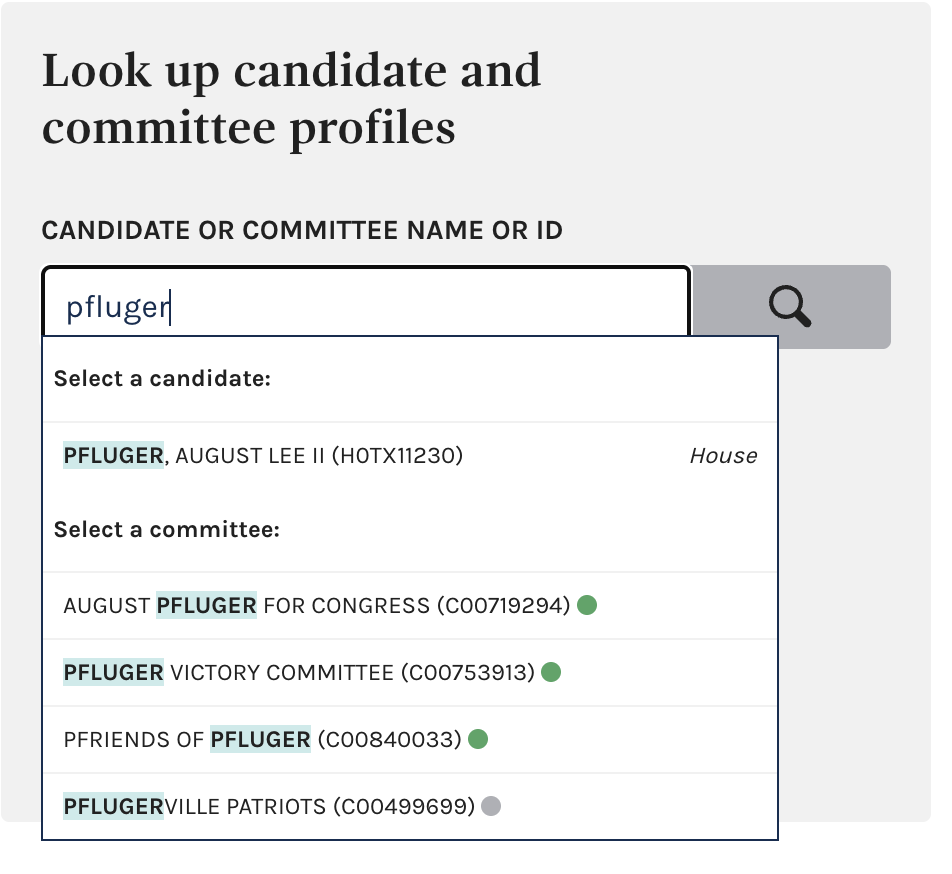
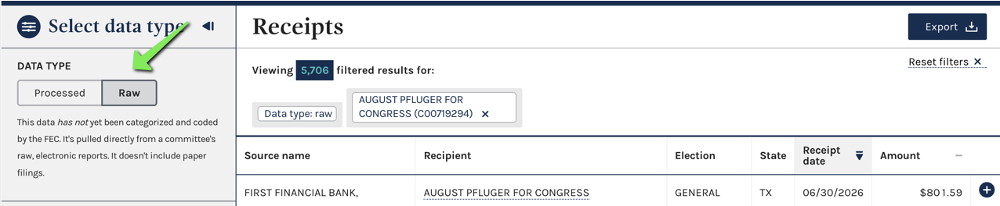
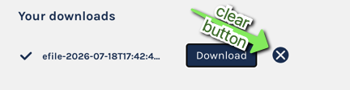
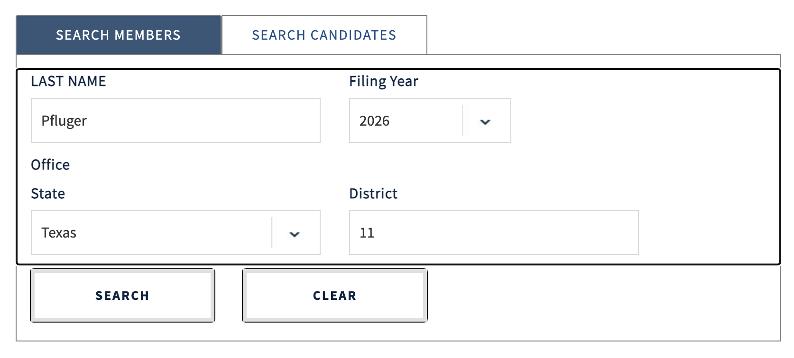

# Pfinance Tracker

This is todb's Pfinance Tracker, useful for tracking the financial disclosures for candidates for the US House of Representatives. Currently, it relies on two major data soruces:

* The FEC
* THe US House Ethics Committee

Each candidate of interest has their disclosures copied here in their respective directories. For example, a candidate for TX-11 named "Pfluger" would end up in `tx-11/pfluger`.

This is mostly an experiment in how far I can get with my AI pals. I'll be documenting my process, prompts, and setup as well, so other people can do similar financial spelunking with robot friends.

# License

The code is licensed under the normal [MIT License](https://mit-license.org)

The prose outputs are largely (but not entirely) machine generated. To the extent possible, the prose is licensed under [CC BY-NC-SA 4.0](https://creativecommons.org/licenses/by-nc-sa/4.0/)

By submitting a contribution, you grant Huge Success, LLC. a perpetual, worldwide, non-exclusive, irrevocable copyright and patent license to use, modify, distribute, sublicense, and relicense your contribution.

# Process

The below details the process of collecting data.

## The FEC

* Make a directory to store FEC things:

`mkdir tx-11/august-pfluger/fec/`

* Go to https://www.fec.gov/data/
* Seach your candidate, and notice active committees, like so:

* Note the committee number you're interested in (in this case, `C00719294`), and make a directory for it: `mkdir -p tx-11/august-pfluger/fec/C00719294`

* Visit the committee page, eg `https://www.fec.gov/data/committee/C00719294/`, and click "Browse Reciepts", once you've checked you're looking at the right year.

* Click Export, and wait a moment. By default, you're exporting the processed data. Save it to the directory you just made.

* Flip over to Raw data, and do it again. What's the precise difference between "processed" and "raw?" Got me, may as well grab them both, more data is always better, right?

* With your browser's back button, go back, and then select "Browse Disbursements," the next section after Receipts.

* Export in the same way; processed, then raw, and save those. You'll want to routinely clear the "Your Downloads" tab because they'll get confusing after about three:

* Take a screenshot of the cash summary, save it, and name it with a timestamp. This will serve as the overall timestamp for this collection. It's a silly way to record a timestamp but machines don't care.

<pre>mv cash-summary.png `date +"%Y-%m-%d-%H-%M-%S-%Z"`-cash-summary.png</pre>

* Move on to the next committee (some candidates have more than one, as seen below).

* Repeat all the above for each commitee, including the cash on hand and timestamp screenshot. Note each committee's ID and create a matching directory.

# Move on to the House Ethics Committee

* Create a directory, `house-ethics` for your candidate or member: `mkdir -p tx-11/august-pfluger/house-ethics`
* Go to https://disclosures-clerk.house.gov/FinancialDisclosure
* Hit Search
* Select Member or Candidate (Member is default)
* Fill in the details.

* Right click on each, "Save Link As" and save them in the `house-ethics` folder.
* Collect each year you're interested in. Note that House races are every two years, so you'll probably want two years' worth of filings.

# Prompts

Now the hard part, the actual data science.

In the old days, we'd use our goop-filled human eyes and read all these boring documents by gaslight.

Then, we got smarter, discovered statistics, then renamed it data science, and built elaborate parsers in R and Python to get through documents like this. But, it still takes forever.

Now, we have access to large language models (LLMs).

The smart way to analyze this stuff is to go through these things would be to leverage our LLM friends to help us write those R and Python parsers to do what we want. This is starting to sound boring agian, though. The [Max Power](https://youtu.be/iVtB7vLRoUo?t=92) way is just ask the LLM to do all the work, then figure out how to prove whatever wild claims it makes. We'll deal with the matter of proof later.

I've got [Visual Studio Code](https://code.visualstudio.com/download) and the [Claude Code for Visual Studio](https://marketplace.visualstudio.com/items?itemName=dliedke.ClaudeCodeExtension) extension, along with a $20/month subscription. Let's go to town.

## First pass

"Analyze the financial disclosure statments in the directory tx-11/pfluger and give me a one-pager summary, in Markdown, called "TX-11 Pfluger Summarized Financial Disclosures." Surface the main take-aways that would be interesting to a political reporter: The major donors, the major disbursments, and anything that jumps out as particularly noteworthy that would surprise the average undecided voter. For example, I would expect you to notice the the reciepts for the Capital Grille, a fine-dining establishment in Washington, D.C., total up to the thousands."
