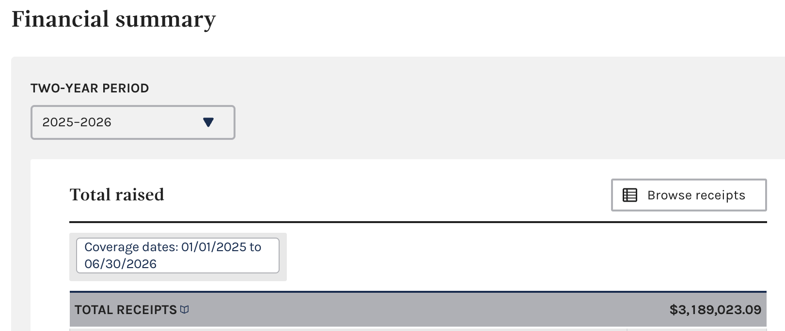
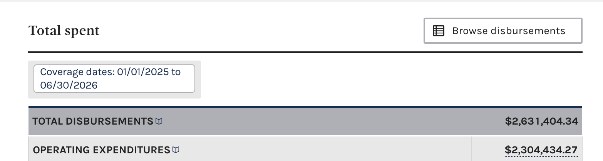
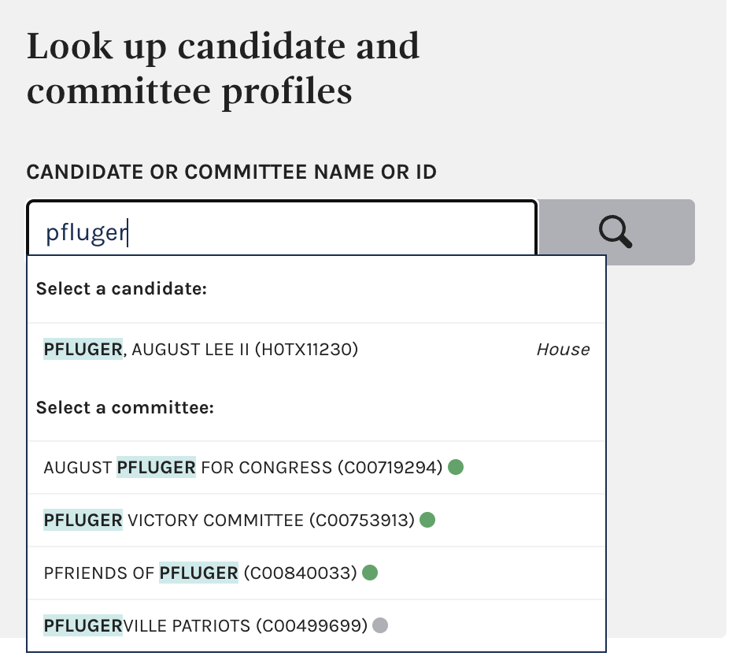

# Pfinance Tracker

This is todb's Pfinance Tracker, useful for tracking the financial disclosures for candidates for the US House of Representatives. It's a toy for now, mostly to teach myself how robust prompt engineering works. The findings shouldn't be believed without rigorous fact-checking.

Currently, it relies on two major data soruces:

* The FEC
* THe US House Ethics Committee

Each candidate of interest has their disclosures copied here in their respective directories. For example, a candidate for TX-11 named "Pfluger" would end up in `tx-11/august-pfluger`.

This is mostly an experiment in how far I can get with my AI pals. I'll be documenting my process, prompts, and setup as well, so other people can do similar financial spelunking with robot friends.

# License

The code is licensed under the normal [MIT License](https://mit-license.org). That said, it's largely (but not entirely) machine-generated, so there's that.

The prose outputs are largely (but not entirely) machine generated. To the extent possible, the prose is licensed under [CC BY-NC-SA 4.0](https://creativecommons.org/licenses/by-nc-sa/4.0/)

By submitting a contribution, you grant Huge Success, LLC. a perpetual, worldwide, non-exclusive, irrevocable copyright and patent license to use, modify, distribute, sublicense, and relicense your contribution.

# Process

This repo has two distinct phases, and they never overlap: **Step 1: Collect** your data, then **Step 2: Analyze** it. Collection means manually exporting from the FEC website (recommended for now) or running `fec-api-client.rb` (experimental — see below) yourself, as an explicit action, to populate a candidate's `fec/` and `house-ethics/` directories on disk. Analysis means handing one of the reusable prompts below to an LLM session and pointing it at those directories.

**The analysis prompts never download anything.** They assume the data they need is already sitting in `$CANDIDATE_DIR/fec/` and `$CANDIDATE_DIR/house-ethics/` before they start. If it isn't there, the correct behavior is to stop and say so — not to reach for `fec-api-client.rb --download` mid-analysis. This matters because collection is a judgment call (which committees, how much history, whether to itemize or just get totals) that belongs to a human — or an LLM explicitly asked to do it as its own separate task — not something that should happen as a side effect of "just write me a summary." Keeping the two steps apart is also what makes the iterative workflow below possible: run a fast, principal-committee-only pass, read what it suggests investigating further, then go collect *those* committees yourself before re-running analysis with the fuller picture.

## Step 1: Collect Your Data

### Collect FEC Data

FEC data comes in two forms: raw efile dumps and structured transaction schedules. You can collect it manually via the FEC web UI or automatically via the OpenFEC API. **Start with the manual way** — see below for why.

#### Manual Way (Recommended, for now)

Manually export from https://www.fec.gov/data/, starting with just the principal committee — a hand-picked, deliberately small set of committees, not "every committee this candidate has ever touched." You can always come back and export more once you (or a Step 2 analysis pass) have a reason to:

* Make a directory to store FEC things. For example, for August Pfluger, running in TX-11, it would be:

`mkdir -p tx-11/august-pfluger/fec/`

* Go to https://www.fec.gov/data/
* Seach your candidate's name, and notice active committees, like so:


* Note the committee number for the **principal campaign committee** (in this case, `C00719294`), and make a directory for it: `mkdir -p tx-11/august-pfluger/fec/C00719294`

* Visit the committee page, eg `https://www.fec.gov/data/committee/C00719294/`, and click "Browse Reciepts", once you've checked you're looking at the right year.



* Click Export, and wait a moment. By default, you're exporting the processed data. Save it to the directory you just made.

* Flip over to Raw data, and do it again. What's the precise difference between "processed" and "raw?" Got me, may as well grab them both, more data is always better, right?


* With your browser's back button, go back, and then select "Browse Disbursements," the next section after Receipts.



* Export in the same way; processed, then raw, and save those. You'll want to routinely clear the "Your Downloads" tab because they'll get confusing after about three:


* **Stop there for a first pass.** A candidate may have several committees (as seen below) — a JFC, a leadership PAC, prior-cycle committee IDs — but don't go collect all of them reflexively.



* Once Step 2's analysis names a specific other committee worth investigating (see "Suggested Committees for Further Investigation" in its output), come back and repeat the steps above for just that committee, noting its ID and making a matching directory.

#### Automated Way (Experimental)

Use [`/tooling/fec-api-client.rb`](tooling/fec-api-client.rb) to download committee data automatically instead. This gets you:
- Raw efile CSVs (comprehensive line-item filings)
- Schedule A (receipts/contributions)
- Schedule B (disbursements)

**Treat this tool as experimental, not a trusted default.** In the course of a single session building it, it turned out to have: a pagination bug that silently re-fetched and duplicated the same 100 rows over and over (one committee's "16,100 rows" were actually just 100 unique transactions repeated 161 times each, which briefly made a $2,500 PAC contribution look like a $402,500 one); a bloat bug that quintupled file sizes with duplicate embedded metadata; and a request-hang bug where a single stuck socket could block an entire download indefinitely. All three are fixed and the fixes were verified against the live API, but three non-trivial correctness bugs surfacing in one sitting is reason enough to not lean on this tool without double-checking its output (e.g. confirm unique `transaction_id` count matches row count) until it's earned more confidence over time.

**Setup:** Get a free API key at https://api.data.gov/ (takes 30 seconds), then:

```bash
echo "your-api-key-here" > .fec_api_key
```

**Quick start:** Download the principal committee's itemized data, scoped to the current cycle to conserve API quota:

```bash
ruby tooling/fec-api-client.rb --download --committee-id C00719294 --output-dir tx-11/august-pfluger/fec --principal --cycle 2026
```

The `--principal` flag marks the principal committee with a `PRINCIPAL` marker file. The `--cycle` flag filters at the API level, cutting the number of pages (and API calls) fetched roughly in proportion to how many cycles the committee has been active — important since the standard API key allows only 1,000 calls/hour.

**Deliberately not automatic: other committees.** An earlier version of this tool had a `--with-linked` flag that recursively crawled every committee that ever appeared as a Schedule B transfer recipient — which pulled in large, unrelated committees (e.g. the NRCC) just because a candidate's JFC wrote them a check. That's gone. The default download above touches only the one committee you name. Run the fast, principal-only pass through Step 2 below first; its output will name other committees worth a look, and deciding whether to actually go collect one — and how deeply — is a Step 1 action you (or an LLM explicitly asked to do just that) take afterward, separately, before re-running analysis. See "Investigating a suggested committee" under "We Must Go Deeper!" below for the two ways to do that (full itemized detail via a plain `--download`, or `--with-affiliated`/`--affiliated-committee-id` for totals only).

**Local caching:** If a committee ID appears in multiple candidate directories, the tool searches your repo for existing cached data and copies it instead of re-downloading, saving API quota.

**Rate limits:** The standard API key allows 1,000 calls/hour. Downloads are paced automatically to avoid tripping burst limits and retry on HTTP 429 (and on transient 502/503/504 gateway errors), but if you exhaust the hourly quota entirely, wait for it to reset (or email apiinfo@fec.gov for a 7,200/hour upgraded key). Interrupted downloads leave partial CSVs on disk (tracked via `.meta` files) but re-running starts a fresh file rather than resuming — use `--cycle` to keep downloads small enough to complete in one pass.

For full documentation and flags, see [tooling/README.md](tooling/README.md).

### Collect House Ethics Committee Data

#### Automated Way


House Ethics Committee data automation is not yet implemented. Contributions welcome! For now, use the manual method below.

#### Manual Way

* Create a directory, `house-ethics` for your candidate or member: `mkdir -p tx-11/august-pfluger/house-ethics`
* Go to https://disclosures-clerk.house.gov/FinancialDisclosure
* Hit Search
* Select Member or Candidate (Member is default)
* Fill in the details.


* Right click on each, "Save Link As" and save them in the `house-ethics` folder.
* Collect each year you're interested in. Note that House races are every two years, so you'll probably want two years' worth of filings.

# Step 2: Analyze

Now the hard part, the actual data science.

In the old days, we'd use our goop-filled human eyes and read all these boring documents by gaslight.

Then, we got smarter, discovered statistics, then renamed it data science, and built elaborate parsers in R and Python to get through documents like this. But, it still takes forever.

Now, we have access to large language models (LLMs).

The smart way to analyze this stuff is to go through these things would be to leverage our LLM friends to help us write those R and Python parsers to do what we want. This is starting to sound boring agian, though. The [Max Power](https://youtu.be/iVtB7vLRoUo?t=92) way is just ask the LLM to do all the work, then figure out how to prove whatever wild claims it makes. We'll deal with the matter of proof later.

I've got [Visual Studio Code](https://code.visualstudio.com/download) and the [Claude Code for Visual Studio](https://marketplace.visualstudio.com/items?itemName=dliedke.ClaudeCodeExtension) extension, along with a $20/month subscription and a working knowledge of Ruby (my R and Python knowledge is much thinner). Let's go to town.

**This step assumes Step 1 is already done.** Every prompt below is written to run against data that already exists on disk. It is not supposed to trigger any download, and if a prompt run notices missing data, the correct move is to stop and tell you to go back to Step 1, not to fetch it there and then; the FEC API is a fickle mistress and cannot be trusted to flow flawlessly mid-investigation.

## Default current cycle summary generation

**Prompt v7** (also folds in raw efile data to cover any gap past the processed export's own coverage — see "Prompt history (v7)" below)

This prompt is a reusable template for the standard one-cycle executive summary — copy everything from the variable block down to the closing quote, fill in `$CANDIDATE`, `$DISTRICT`, and `$CYCLE`, and hand it to a fresh LLM session. (For multi-cycle or focused deep-dive analyses — including any of the committees this prompt's output suggests investigating — see "We Must Go Deeper!" below.)

**Before you hand this prompt to an LLM: make sure Step 1 is done.** `$CANDIDATE_DIR/fec/` needs at least one committee subdirectory with `schedule_a-*.csv` and `schedule_b-*.csv` files in it already (see "Step 1: Collect Your Data" above). This prompt does not collect data itself.

**START PROMPT**

```
CANDIDATE: `Candidate Name`
DISTRICT: `District Name`
CYCLE: `2026` (or current election cycle)
```

Every `$CANDIDATE` / `$DISTRICT` below is that same substitution. `$CANDIDATE_DIR` is not filled in separately — derive it from $CANDIDATE and $DISTRICT using the convention already shown in "Process" above (lowercased district + kebab-case candidate name, e.g. `TX-11` + `August Pfluger` → `tx-11/august-pfluger`); if a close-but-not-exact match already exists under `tx-*/`, use that directory instead of creating a new one.

**Prompt history (v7):** A v6 run on Claire Reynolds's committee (TX-11, C00929711) reported her donor/spending activity as ending 2026-03-31, silently missing an entire second quarter (April–June 2026) that the campaign had already filed. The cause: `analyze-candidate.rb` only ever read `schedule_a-*.csv`/`schedule_b-*.csv` — fec.gov's "processed" bulk exports — and those can lag well behind what's actually been filed, sometimes by months, with no warning that they're stale. The raw `efile-*.csv` data sitting in the same directory (from clicking "Raw data" during Step 1's manual export, or from `fec-api-client.rb`'s automated download) already had the missing quarter; the tool just never looked at it. `analyze-candidate.rb` now reads `efile-*.csv` itself — but only ever for the narrow slice of rows dated strictly after whatever date the processed schedule_a/schedule_b export already covers, and only once per committee/schedule. It never touches or re-derives anything for a period the processed files already cover, which is what keeps this safe against the double-counting risk that kept efile out of scope entirely before (v6 and earlier told this prompt to never glob `efile-*.csv` in at all — see the v6 note below for why that caution existed, and gotcha 8 in `tooling/analyze-candidate.rb`'s header for the amendment-handling and name-casing details that make gap-filling correct rather than just plausible-looking). Nothing changed in this prompt's own instructions to make this happen — v7 exists only to record the incident and point at the tool as the actual fix, per this repo's standing rule that data-integrity logic lives in `analyze-candidate.rb`'s header, not duplicated here. One thing this prompt now does ask for explicitly: if the tool's output includes an `EFILE COVERAGE WARNING` banner, say so in the Methodology section (see the updated Methodology instructions below) rather than letting it pass unremarked — the whole point of surfacing it is so a reader can tell the difference between "no more recent filings exist" and "more recent filings exist and are already reflected below."

**Prompt history (v6):** v5 restricted this prompt to the principal committee **only**, even if other committees (a JFC, a leadership PAC) were already sitting collected in `$CANDIDATE_DIR/fec/`. That was overcorrection: the actual invariant Step 2 needs to hold is "never download, itemize, or otherwise collect anything itself" — not "only ever look at one committee." A user (or an LLM doing Step 1 as its own deliberate task) might already know a candidate's JFC matters and go collect it manually before ever running this prompt — say, because they read a prior "Suggested Committees" note, or just already knew about Raptor PAC and Pfluger Victory Committee and grabbed them alongside the principal committee from the start. Refusing to use data that's already sitting on disk, correctly collected, would be perverse. v6 analyzes **everything already collected** under `$CANDIDATE_DIR/fec/` — one committee or several — and reserves "Suggested Committees for Further Investigation" for naming committees that are visible but *not yet* collected, exactly as before.

**Prompt history (v5):** v4 still had this prompt run `fec-api-client.rb --download` itself, right before the analysis step, on the theory that a "principal committee only" download was narrow enough to be safe. In practice that still meant an analysis prompt could reach for the network and decide, on its own, that data needed fetching — the same instinct that led earlier versions to auto-chase linked/affiliated committees. v5 removes the download command from this prompt entirely. Collection (Step 1) and analysis (Step 2) are now strictly separate: if the required `fec/` data isn't already on disk when this prompt runs, **stop and say so** — tell the user which committee ID(s) to collect and point them at "Step 1: Collect Your Data" above — rather than fetching it yourself. This also makes the iterative workflow explicit: fast-pass on just the principal committee, read what it suggests investigating, go collect those committees yourself (Step 1 again, deliberately), then re-run this same analysis prompt against the now-larger `fec/` directory.

**Prompt history (v4):** v3 had this prompt download the principal committee's data plus, via a `--with-affiliated` flag, another committee auto-discovered by name search (and before that, a `--with-linked` flag that recursively crawled every committee ever referenced in a Schedule B transfer). Both put the *tool* in charge of deciding which other committees mattered — which either missed the committee that actually carried most of a candidate's money (a JFC's name search can fail; see `tooling/fec-api-client.rb`'s header) or, worse, pulled in large, unrelated committees (a party committee, another candidate's committee) that happened to receive a transfer. v4 scoped this prompt to the principal committee **only**, with `analyze-candidate.rb`'s own Schedule B data (a `recipient_committee_id` for any transfer recipient that's itself a committee — zero extra API calls) feeding a "Suggested Committees for Further Investigation" output section instead of an automatic download.

**Prompt history:** the pilot run of this prompt (TX-11/August-Pfluger) shipped a summary with a "Correction (post-publication review)" section — it took a second pass, prompted by a human asking pointed questions, to catch a couple of data-integrity bugs after the fact. Both are now fixed in [`/tooling/analyze-candidate.rb`](tooling/analyze-candidate.rb) and documented in its header comments, not repeated here — see the note below on why. This prompt tells the model to read and reuse that tool up front, specifically so a fresh session doesn't rediscover the same bugs before it can trust its own numbers. A "Correction" section in the output is a sign this prompt or the tool needs another pass, not an acceptable steady state.

**Tooling requirements:** Any tooling written to perform this analysis must be written in Ruby, using the version pinned in [`.ruby-version`](.ruby-version). Save all tooling artifacts (scripts, Rakefiles, etc.) to the `/tooling` directory. Gems should be managed normally with Bundler and a `Gemfile`, so the repo remains portable and reproducible for anyone with `rbenv` and `bundler` installed. **Before writing anything new, check whether [`/tooling/analyze-candidate.rb`](tooling/analyze-candidate.rb) already exists and covers this candidate's data** (`bundle exec ruby tooling/analyze-candidate.rb --help` shows its interface). It's built to be reused across candidates via `--fec-dir` / `--house-ethics-dir` arguments — extend it in place if a candidate's filings need something it doesn't handle yet, rather than writing a parallel one-off script. **Read that file's header comments in full before trusting or reporting any total** — they hold the specific, tested data-integrity gotchas (duplicate/amended filings, dropped correction rows, lump-sum vendor payments that look unitemized but aren't, and more) as close to the code they explain as possible, so they stay accurate as the tool changes instead of drifting out of sync with a second copy kept here.

**Analyze financial disclosure documents for $CANDIDATE ($DISTRICT) and create an executive summary for the $CYCLE election cycle only.**

**Scope:** This analysis covers **every committee already collected** under `$CANDIDATE_DIR/fec/` as of when this prompt runs — that might be just the principal committee, or it might already include a JFC, leadership PAC, or other committee the user (or a prior Step 1 pass) deliberately gathered alongside it. Use all of it; `analyze-candidate.rb` folds every locally-present committee's itemized data into one combined analysis automatically, whether that's one committee or several. What this prompt must **not** do is collect anything new itself — don't download, itemize, or otherwise pull in data for any committee that isn't already sitting in `fec/`, even if one is named or visible in already-downloaded data (e.g. a JFC's name showing up in a Schedule A transfer row) — see "Suggested Committees for Further Investigation" below for how to handle those instead. Also cover **only** transactions dated within the $CYCLE election cycle (filed in $CYCLE); do not include historical cycles or outdated filings, even if older data exists in the source files.

**Before doing anything else, verify the data is already collected:** check that `$CANDIDATE_DIR/fec/` contains at least one committee subdirectory (matching `C\d{6,}`) with `schedule_a-*.csv` / `schedule_b-*.csv` files in it — there may be just one, or several. **If there are none at all, stop here.** Tell the user data collection hasn't happened yet, point them at "Step 1: Collect Your Data" in this README, and do not run `fec-api-client.rb --download` yourself to fill the gap — that decision (which committee(s), how much history, itemized vs. totals) belongs to Step 1, not to this analysis prompt.

**Once the data is confirmed present, run this:**
```bash
ruby tooling/analyze-candidate.rb \
  --fec-dir $CANDIDATE_DIR/fec \
  --house-ethics-dir $CANDIDATE_DIR/house-ethics \
  --cycle $CYCLE
```

Use the output as your source data. The tool filters transactions to the specified cycle and documents any data-integrity warnings, including a list of committees seen as Schedule B transfer recipients (raw material for the Suggested Committees section — the tool does not download or itemize these itself) and, if present, an `EFILE COVERAGE WARNING` banner (see gotcha 8 in the tool's header) showing that raw efile data extending past the processed schedule_a/schedule_b export's own coverage has already been folded into the totals below it. Read the tool's header comments (in `/tooling/analyze-candidate.rb`) to understand how it handles multi-cycle data, amendments, and efile gap-filling.

**Output:**
- Format: Markdown
- Filename: `$CANDIDATE_DIR/README.md`
- Length: Main analysis should be roughly 2,000 words. The complete Methodology & AI Transparency section (including the full verbatim prompt) doesn't count against this word limit.
- Title: `$DISTRICT: $CANDIDATE — Financial Disclosure Summary ($CYCLE Cycle)`

**Content sections (in this order):**

1. **Key Donors** — Top 5-10 individual/corporate donors by contribution amount in the $CYCLE cycle, drawn from every committee already collected under `$CANDIDATE_DIR/fec/` (just the principal committee, or that plus a JFC/leadership PAC/other committee if those were already gathered too). Include amounts and donor affiliation where relevant. If a large share of the candidate's money likely moved through a committee that is **not** locally collected, say so plainly rather than implying this list is the complete donor picture.

2. **Major Spending** — Top disbursements by category (e.g., staff, consulting, media, events) in the $CYCLE cycle. Highlight any unusual or notable expenditures.

3. **Takeaways** — 3-5 findings that are newsworthy, unexpected, or revealing about the candidate's priorities, funding sources, or spending patterns in the $CYCLE cycle. Examples: unusual donor relationships, spending that contradicts public messaging, geographic patterns, or high-interest items like luxury dining or travel.

4. **Suggested Committees for Further Investigation** — A short, judgment-based list (not an exhaustive dump) of committees that are **not yet collected** under `$CANDIDATE_DIR/fec/` but worth a deliberate follow-up look, drawn **only from data already local** — `analyze-candidate.rb`'s "committees seen as transfer recipients" list, or a committee name/ID already visible somewhere in the already-downloaded CSVs (e.g. a JFC named in a Schedule A "Transfers from authorized committees" row) that hasn't itself been collected yet. Do not make a live API call (e.g. to check `affiliated_committee_name`) to populate this section — that would itself be a collection action, which this prompt doesn't do. For each committee named, note why it might matter and how a human would pursue it later (`fec-api-client.rb --download --committee-id <id>` for full itemized data, or `--with-affiliated` for totals only — see "We Must Go Deeper!"). If everything obviously relevant already appears to be collected, say so briefly rather than padding this section. This section is explicitly a pointer for a human's future Step 1 pass, not a second analysis now — don't itemize or deep-dive any newly-named committee in this same run, even though you're free to fully use whatever's already collected in the sections above.

5. **Methodology & AI Transparency** — Disclose the LLM model name/version (e.g., Claude 3.5 Sonnet), key configuration settings (temperature, token limits), and the exact prompt used to generate this analysis (i.e. this template with $CANDIDATE/$DISTRICT/$CYCLE filled in). List every committee ID actually analyzed (there may be more than one). Include the exact `analyze-candidate.rb` command you ran, and note (without re-running them) which `fec-api-client.rb --download`/manual-export steps originally populated each committee directory this analysis reads from, if that's discoverable (e.g. from `.download-progress` marker files, or their absence if the committee was collected manually) — so a reader can tell what data collection actually happened, even though this analysis pass didn't perform it. This transparency allows readers to understand how findings were produced, assess potential model limitations or biases, and reproduce the analysis if desired. If applying `analyze-candidate.rb`'s data-integrity gotchas changed a finding versus a naive read of the data, say so briefly here instead of adding a separate correction section — this prompt already expects that check to happen before publication, not after. If the tool's output included an `EFILE COVERAGE WARNING` banner for any committee, state that plainly here too: which committee(s)/schedule(s), the date range the processed export was missing, and roughly how much money that added — so a reader can tell the difference between "no more recent filings exist" and "more recent filings exist and this report already reflects them."

**Tone:** Analytical, conversational for a general political audience. Avoid jargon; explain significance where needed.

**Source:** FEC and House Ethics Committee disclosures in the `$CANDIDATE_DIR/` directory, filtered to the $CYCLE cycle and to whichever committees were already collected there as of this run."

**END PROMPT**

# We Must Go Deeper!

The "Default current cycle summary generation" section above produces a fixed, one-cycle executive summary — a high-level snapshot of the current filing period's top donors, spending, and takeaways. But a candidate's financial story often spans multiple cycles, and worth investigating are focused cuts: all corporate/PAC donations across their career, individual donors giving above a threshold in each cycle, or how spending priorities have shifted over time.

This section documents how to build such deep-dive analyses, reusing the existing `analyze-candidate.rb` tool to power them rather than writing parallel scripts. The same Step 1/Step 2 split applies here: "Collecting multi-cycle data" and "Investigating a suggested committee" below are both Step 1 (data collection, run yourself, before analysis) — the "Deep-dive prompt template" further down is Step 2 (analysis only, no downloading), same as the main summary prompt.

## Output convention

Deep-dive reports live in a new `deep-dives/` subdirectory alongside the existing `README.md`:

```
tx-11/august-pfluger/
├── README.md                          # current-cycle summary (unchanged)
├── fec/
├── house-ethics/
└── deep-dives/
    ├── full-history.md                # multi-cycle career analysis
    ├── corporate-donors.md            # focused: corporate/PAC donations
    └── large-individual-donors.md     # focused: individual donors >$50k per cycle
```

Each deep-dive file follows the same `$CANDIDATE`/`$DISTRICT`/`$CANDIDATE_DIR` substitution convention already established, and the same "Methodology & AI Transparency" format as the main README, with a verbatim prompt appended for reproducibility.

## Collecting multi-cycle data

For full-career or multi-year deep dives, you need FEC data spanning multiple cycles. **The first automated download gets all currently available data** — the OpenFEC API returns complete transaction history for a committee, regardless of cycle.

**Initial setup (one-time):** The first download via `fec-api-client.rb` automatically retrieves all available historical data for a committee:

```bash
ruby tooling/fec-api-client.rb --download --committee-id C00719294 --output-dir tx-11/august-pfluger/fec --principal
```

This populates `tx-11/august-pfluger/fec/C00719294/` with:
- All schedule_a filings (complete transaction history)
- All schedule_b filings (complete transaction history)
- All raw efile submissions (all years)

The `analyze-candidate.rb` tool then reads the `two_year_transaction_period` field on each row to segregate by cycle when you use flags like `--by-cycle` or `--cycle 2026`.

**Updating later:** If new filings appear after your initial download, re-run the download command to the same committee directory — it will fetch fresh data and add it alongside existing files. The caching mechanism won't interfere because you're downloading to the same location.

**For prior, now-terminated committee IDs:**
If your candidate ran under a different committee ID in an earlier cycle (discoverable via the FEC committee page's "Affiliated/Related committees" link), create a new `fec/<old-committee-id>/` directory and download that committee's data separately:

```bash
ruby tooling/fec-api-client.rb --download --committee-id C00OLD123 --output-dir tx-11/august-pfluger/fec
```

This protects against a known naming footgun: the script only recognizes committee directories matching `/\AC\d{6,}\z/` (committee ID, C-prefix). If you accidentally name a directory after the FEC candidate ID (H-prefix, e.g. `H6TX11112`) instead of the committee ID, the tool silently finds zero committees and reports all-zero totals with no warning — so use the committee ID consistently.

## Investigating a suggested committee

The default summary prompt above deliberately stops at the principal committee and, at most, names other committees worth a look (see its "Suggested Committees for Further Investigation" section) without downloading their data. Once a human (or a fresh LLM session) decides one is worth pursuing, there are two levels of depth to choose from, both via `fec-api-client.rb`:

**Full itemized treatment** — same as any principal committee, just point it at the other committee's ID and the same `fec/` directory:
```bash
ruby tooling/fec-api-client.rb --download --committee-id <committee-id> --output-dir tx-11/august-pfluger/fec --cycle 2026
```
`analyze-candidate.rb` will then fold it into the normal donor/spending analysis alongside the principal committee (it doesn't distinguish "principal" from "other" for itemized purposes — the `PRINCIPAL` marker file is informational only).

**Totals only** — enough to see the scale of money moving through a committee without itemizing it:
```bash
# Auto-discover by name (reads the principal's own affiliated_committee_name field):
ruby tooling/fec-api-client.rb --download --committee-id <principal-id> --output-dir tx-11/august-pfluger/fec --with-affiliated --cycle 2026

# Or name a specific committee ID directly (e.g. one from the transfer-recipients list):
ruby tooling/fec-api-client.rb --download --committee-id <principal-id> --output-dir tx-11/august-pfluger/fec --affiliated-committee-id <committee-id> --cycle 2026
```
This writes `totals.json` (no itemized rows) to that committee's directory; `analyze-candidate.rb` reports it in its own "AFFILIATED COMMITTEES" section, separate from itemized totals.

Neither of these should be run automatically as part of the default summary prompt, or by an LLM mid-analysis — see the v5 prompt-history note above for why. Run them yourself (or ask an LLM to run just this, as its own explicit task) as Step 1, then re-run Step 2 analysis afterward against the enlarged `fec/` directory.

## New tool flags for deep dives

Run `bundle exec ruby tooling/analyze-candidate.rb --help` to see the full reference, but the key additions are:

| Flag | Purpose | Example |
|------|---------|---------|
| `--by-cycle` | Group donors and disbursements by FEC 2-year cycle, newest-first, instead of one combined total. Surfaces cycle-integrity warnings if any rows have mismatched `two_year_transaction_period` and `fec_election_year` fields. | `--by-cycle` |
| `--cycle YYYY` | Scope the entire report (donors, disbursements, card breakdown) to a single cycle. Overrides `--by-cycle` if both are given. | `--cycle 2026` |
| `--min-amount N` | In addition to the normal `--top N` table, report *every* donor (subject to any active `--cycle` or `--donor-type` filter) whose aggregate per-donor total is ≥ N. | `--min-amount 50000` |
| `--donor-type TYPE` | Restrict to `individual` or `committee` donors (using the FEC's `is_individual` field). Note: there is no structured "corporate" field in this data — narrowing to `committee` is the mechanical step; identifying which committees are corporate-PAC-affiliated requires manual inspection of names. | `--donor-type individual` |

## Example deep-dive use cases

**Full career history:** Show all donors and spending across every cycle you've collected:
```bash
bundle exec ruby tooling/analyze-candidate.rb --fec-dir tx-11/august-pfluger/fec --house-ethics-dir tx-11/august-pfluger/house-ethics --by-cycle
```

**Individual donors >$50k aggregate per cycle:**
```bash
bundle exec ruby tooling/analyze-candidate.rb --fec-dir tx-11/august-pfluger/fec --by-cycle --donor-type individual --min-amount 50000
```

**All committee/PAC donors (corporate, party, leadership PAC, etc.):**
```bash
bundle exec ruby tooling/analyze-candidate.rb --fec-dir tx-11/august-pfluger/fec --by-cycle --donor-type committee
```

**Single-cycle deep dive (e.g. 2024-2026):**
```bash
bundle exec ruby tooling/analyze-candidate.rb --fec-dir tx-11/august-pfluger/fec --cycle 2026
```

## Deep-dive prompt template

Like "Default current cycle summary generation" above, this is a reusable template for a deep-dive analysis, and the same rule applies: **it assumes Step 1 is already done and does not download anything itself.** Fill in the bracketed placeholders and hand the prompt to a fresh LLM session:

```
CANDIDATE: `Candidate Name`
DISTRICT: `District Name`
TOPIC: `Full Career History` or `Corporate & PAC Donors` or `Large Individual Donors (>$50k/cycle)` — whatever this dive investigates.
TOOL_FLAGS: The `--by-cycle`, `--cycle`, `--min-amount`, and/or `--donor-type` flags to run the analysis with.
```

**Before doing anything else, verify the data this deep dive needs is already collected** (e.g. multi-cycle history via "Collecting multi-cycle data" above, or a specific committee via "Investigating a suggested committee" above). If it isn't there, stop and say so — point the user at the relevant Step 1 instructions rather than downloading it yourself.

**Analyze financial disclosure documents for $CANDIDATE ($DISTRICT) and create a deep-dive report on $TOPIC.**

**Output:**
- Format: Markdown
- Filename: `$CANDIDATE_DIR/deep-dives/$TOPIC.md` (use a kebab-case slug of the topic in place of `$TOPIC`, e.g. `full-history.md`, `corporate-donors.md`, `large-individual-donors.md`)
- Title: `$DISTRICT: $CANDIDATE — $TOPIC`
- Structure: Adapt the "Key Donors," "Major Spending," and "Takeaways" sections to fit your topic. For a multi-cycle career deep dive, you might instead have per-cycle subsections, trend analysis, or shift analysis. For a donor-type focus like "all corporate/PAC donors," your structure might emphasize industry patterns, donor relationships, or PAC-to-candidate flows rather than top-10 lists.
- Methodology & AI Transparency section: **Include the verbatim tool command** you used to generate this report (e.g. `bundle exec ruby tooling/analyze-candidate.rb --fec-dir tx-11/august-pfluger/fec --by-cycle --donor-type committee`), so readers can reproduce the analysis. Reference the updated header comments in `/tooling/analyze-candidate.rb` regarding cycle integrity and multi-cycle data handling, distinct from the current-cycle summary prompt.

**Tone:** Same as the main README — analytical, conversational for a general political audience.

**Source:** All data from FEC and House Ethics Committee disclosures in the `$CANDIDATE_DIR/` directory. Before writing prose, run the tool's output through the same data-integrity review you would for a summary: **read `/tooling/analyze-candidate.rb`'s header comments in full** — they document cycle-matching gotchas, the multi-committee/multi-cycle data model, and why cycle-integrity warnings exist. Spot-check any surprising findings against the source CSVs before publication."
